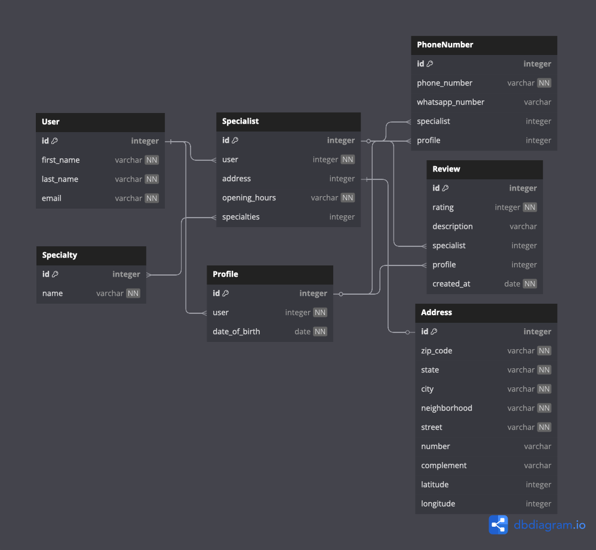

# Projeto para a disciplina Projeto Integrador – Análise de Soluções Integradas para Organizações

## Modelo físico do banco de dados

[](https://dbdocs.io/embed/b65bef8cf417d931a62afdd5ff6b1ff1/314698636cd94b9e80c1b85e92b34351)

## Instalação e configuração do projeto

### Configurar repositório 

Clonar o repositório utilizando HTTPS:

```shell
git clone https://github.com/senac-pi-analise-solucoes-integrad-orgs/pi-analise-solucoes-integradas-orgs.git
```
Ou utilizando SSH:
   
```shell
git clone git@github.com:senac-pi-analise-solucoes-integrad-orgs/pi-analise-solucoes-integradas-orgs.git
```

Entrar na pasta do projeto:

```shell
cd pi-analise-solucoes-integradas-orgs
```

### Configurar ambiente virtual Python

#### Criar ambiente virtual

```shell
python -m venv .venv
```

Caso não funcione com `python`, você pode tentar com `python3`.

#### Entrar no ambiente virtual

```shell
source .venv/bin/activate
```

Caso seu ambiente seja Microsoft Windows, utilize:

```shell
.\venv\Scripts\activate
```

#### Instalar pacotes necessários

```shell
pip install -r requirements.txt
```

### Configurar banco de dados 

#### Executar migrate para criar as tabelas

```shell
python manage.py migrate
```

#### Criar Super Usuário

```shell
python manage.py createsuperuser
```

### Rodar a aplicação

#### Iniciar o servidor

```shell
python manage.py runserver
```

#### Abrir aplicação no navegador

- Acessar aplicação link [http://localhost:8000/](http://localhost:8000/)
- Administração no link [http://localhost:8000/admin/](http://localhost:8000/admin/) 

# Link Do FIGMA para base de Pré-Projeto

- Acessar o projeto link https://www.figma.com/design/atLuWZJJmQx8BcZqgy6LPy/AUTISMO_E_APOIO?node-id=55-2&t=UCI3yTqfDXOrEL22-0

## Telas


